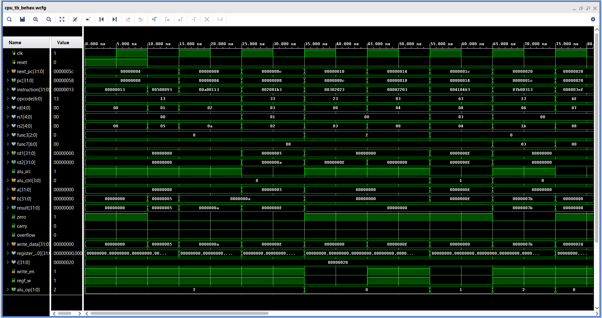

# Testing and Waveforms

The processor was verified using custom Verilog testbenches in Vivado.

Testing focused on validating datapath behavior, control logic generation, memory operations, and Program Counter updates.

---

# Operations Tested

## Arithmetic Instructions
- add
- sub
- addi

## Logical Instructions
- and
- or
- xor

## Shift Instructions
- sll
- srl
- sra

## Comparison Instructions
- slt
- sltu

## Memory Operations
- lw
- sw

## Branch Instructions
- beq
- bne
- blt
- bge

## Jump Instructions
- jal
- jalr

---

# Important Verifications

## Register File
- register write-back verified
- x0 protection verified

## ALU
- arithmetic operations verified
- signed and unsigned comparisons verified
- shift operations verified

## Memory
- store operations verified
- load operations verified
- address alignment verified

## Branching
- branch taken condition verified
- branch not taken condition verified
- PC update behavior verified

## Jump Instructions
- jump target computation verified
- return address storage verified

---

# Waveform Analysis

Waveforms were used to verify:
- instruction fetch behavior
- ALU result generation
- control signal generation
- memory access
- branch target updates
- Program Counter transitions

Special attention was given to branch and jump instructions since they modify normal sequential execution flow.

---

# Simulation Environment

- Vivado Simulator
- Verilog HDL
- Custom testbench programs

Simulation helped identify and fix:
- incorrect ALU source selection
- memory indexing issues
- jump target alignment
- AUIPC datapath handling
- write-back source selection

---

# Testing and Waveforms

The processor was tested in Vivado using custom testbench programs.

The waveform below shows successful execution of arithmetic operations, memory access, branching, and jump instructions.

